## Scope

This post explains all the steps you need to take to deploy a site on Cloudflare Pages. Perfect for quickly deploying a frontend, a blog or a landing page. It doesn't go through all features of Cloudflare, please check the [official documentation](https://developers.cloudflare.com/pages/) if needed.

I'll use this blog as example (Hugo website hosted on the custom domain `dafidev.com`)

Covered in this post:
- Cloudflare configuration
- Continuous deployment
- Custom domain
- Restricted access to preview deployments

Not covered:
- Analytics
- Dynamic website, backend database...
- Actually building the site (example with Hugo covered in [this post]())

## Prerequisites

You'll need to own an account on [Cloudflare](https://dash.cloudflare.com/) and on [GitHub](https://github.com).

You'll also need to own a domain name, otherwise the URL of your website will end with ".pages.dev"

This post assumes you already have a static website to be deployed. This guide is framework-agnostic : I'll use a Hugo website for the example, but it would also work fine for Next.js, Flutter, plain HTML, React, Vue, Angular...

## Deployment walkthrough

### Cloudflare project

Log in to the [Cloudflare dashboard](https://dash.cloudflare.com/) and go to "Compute & AI" then "Workers & Pages". You should see this screen:

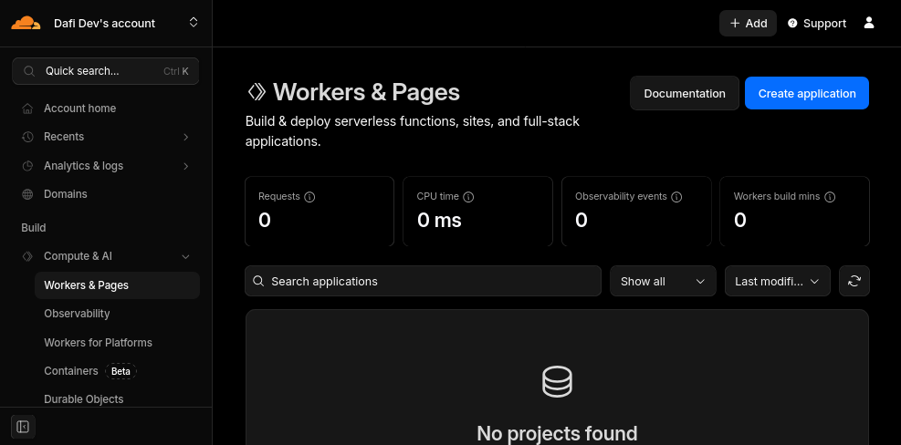

Click on the "Create application" button on top right, the following popup will appear:

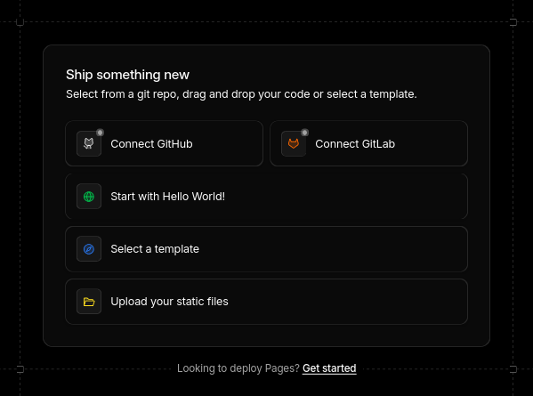

Click on the "Get started" link at the bottom (other buttons will create a Worker, but we only want a Page project)

You are now given the choice between importing a git repository or drap & drop files.

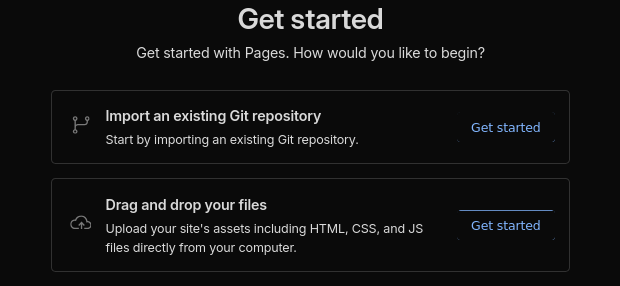

Importing a git repository means building the static site will be handled by Cloudflare, but the free package comes with limits.

Drag & drop options actually also supports API access and GitHub Actions uploading, which means building the site will be handled by GitHub, which is completely free for open source projects.

I'm going for the drag & drop solution combined with GitHub Actions, but feel free to choose what suits you best.

You'll then be asked for the project name. If you plan to use a custom domain name, the project name doesn't matter as it will never be exposed to end users. If you do not have a domain name, your website will be deployed to the URL {project name}.pages.dev

If you went for the drag & drop option you'll be asked to upload your site already. You can upload an empty HTML file for now. Your actual website will be automatically deployed when we set up GitHub Actions.

After clicking on "Deploy site" you should see this screen:

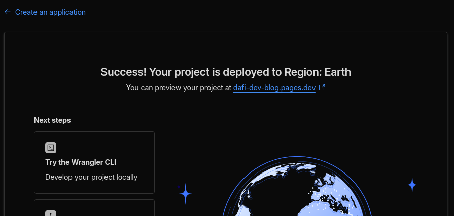

You can now see your project from the "Worker & Pages" dashboard page:

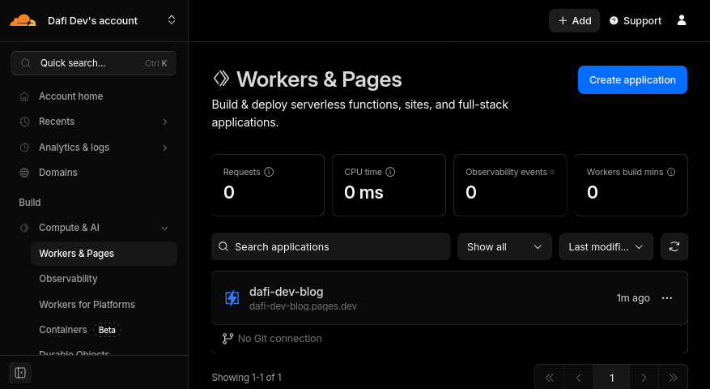

### Continuous deployment

You can skip this step if you went for the option of importing a git repository earlier.

This step consists of automatically deploying the latest version of your website whenever changes are pushed to git, so that you don't need to manually do a drag & drop. It supports productive and preview deployment based on the branch. This section is basically a summary of [Use Direct Upload with continuous integration](https://developers.cloudflare.com/pages/how-to/use-direct-upload-with-continuous-integration/).

#### Get credentials

You'll need your Account ID and an API token to set up continuous deployment.

Your **Account ID** is visible from the URL of Cloudflare dashboard when you navigate to your project:

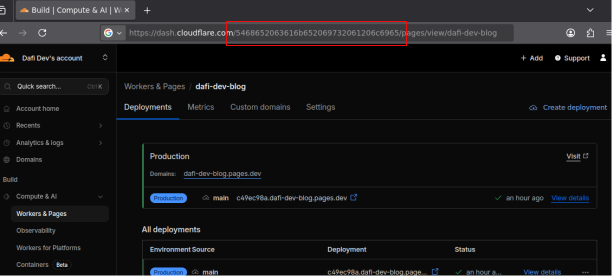

To get an **API Token**, go to [Account API tokens](https://dash.cloudflare.com/?to=/:account/api-tokens) and click on the "Create Token" button.

Then click on "Get Started" next to "Create Custom Token":

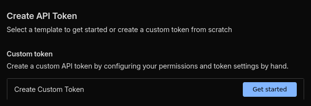

You now have to name your API token and select the permissions. The name is never displayed to end users, just use something descriptive to you. For the permissions, you need to select *Account*, then *Cloudflare Pages* and *Edit* as shown below:

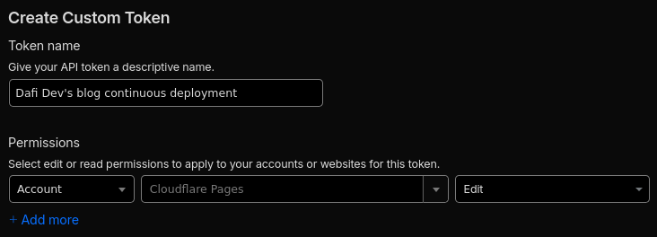

You now need to click on "Continue to summary" and "Create Token". You should end up in a screen similar to this one:

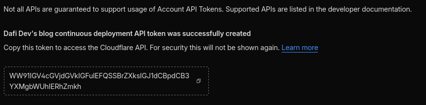

Temporarily take note of this token, but keep it in a safe place as anybody with the token can modify the contents of your Cloudflare Pages projects!

#### Configure GitHub secrets

I'll use GitHub for the example but most git platforms like GitLab or Gitea would work in a similar way.

Go to the settings of your git repository, to to "Secrets and variables" and select "Actions":

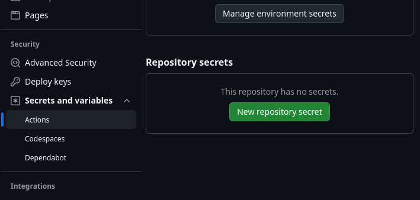

You'll need to use the "New repository secret" to create the 2 secrets for the Account ID and API token.

The Account ID secret should be named **CLOUDFLARE_ACCOUNT_ID**:

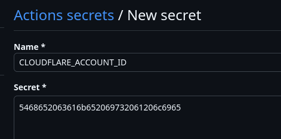

The API token secret should be named: **CLOUDFLARE_API_TOKEN**:

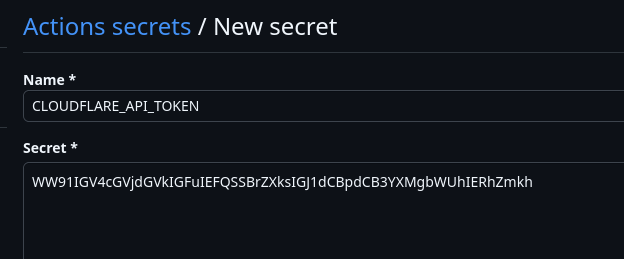

#### Configure GitHub Actions workflow

Create the following file at `.github/workflows/pages-deployment.yaml`:

```yaml
on: [push, workflow_dispatch]
jobs:
  deploy:
    runs-on: ubuntu-latest
    permissions:
      contents: read
      deployments: write
    name: Deploy to Cloudflare Pages
    steps:
      - name: Checkout
        uses: actions/checkout@v4
      # Run your project's build step
      # - name: Build
      #   run: npm install && npm run build
      - name: Deploy
        uses: cloudflare/wrangler-action@v3
        with:
          apiToken: ${{ secrets.CLOUDFLARE_API_TOKEN }}
          accountId: ${{ secrets.CLOUDFLARE_ACCOUNT_ID }}
          command: pages deploy YOUR_DIRECTORY_OF_STATIC_ASSETS --project-name=YOUR_PROJECT_NAME
          gitHubToken: ${{ secrets.GITHUB_TOKEN }}
```

Change `YOUR_PROJECT_NAME` to the name of your project. For me it's `dafi-dev-blog`.

Uncomment the step to build the site and add more steps if needed. This will depend on the framework you're using. The [official documentation](https://developers.cloudflare.com/pages/framework-guides) contains guides for most popular frameworks. Change `YOUR_DIRECTORY_OF_STATIC_ASSETS` to the folder in which your static site is built. This also depend on your framework.

Example for my setup (to deploy this blog using the Hugo framework):

```yaml
on: [push, workflow_dispatch]
jobs:
  deploy:
    runs-on: ubuntu-latest
    permissions:
      contents: read
      deployments: write
    name: Deploy to Cloudflare Pages
    steps:
      - name: Checkout
        uses: actions/checkout@v4
        with:
          fetch-depth: 0
      - name: Cache Hugo resources
        uses: actions/cache@v3
        with:
          path: resources/_gen
          key: ${{ runner.os }}-hugo-resources-${{ github.ref_name }}-${{ github.sha }}
          restore-keys: |
            ${{ runner.os }}-hugo-resources-${{ github.ref_name }}-
            ${{ runner.os }}-hugo-resources-main-
      - name: Cache node_modules
        uses: actions/cache@v3
        with:
          path: node_modules
          key: ${{ runner.os }}-node-${{ github.ref_name }}-${{ hashFiles('**/package-lock.json') }}
          restore-keys: |
            ${{ runner.os }}-node-${{ github.ref_name }}-
            ${{ runner.os }}-node-main-
      - name: Setup Hugo
        uses: peaceiris/actions-hugo@v3
        with:
          hugo-version: "0.154.5"
          extended: true
      - name: Build
        run: hugo --minify --logLevel=debug
      - name: Deploy
        uses: cloudflare/wrangler-action@v3
        with:
          apiToken: ${{ secrets.CLOUDFLARE_API_TOKEN }}
          accountId: ${{ secrets.CLOUDFLARE_ACCOUNT_ID }}
          command: pages deploy public --project-name=dafi-dev-blog
          gitHubToken: ${{ secrets.GITHUB_TOKEN }}
```

#### Configure the main branch

Make sure the name of the main branch in your git repository matches the production branch setting in Cloudflare! Otherwise Cloudflare may mix preview and productive deployments.

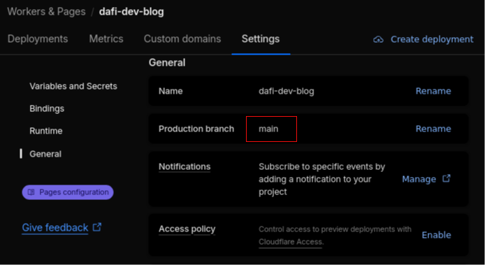

I also recommend to protect the main branch since its contents will be visible by end users. In the repository settings go to the "Rules" section and add a rule to protect your main branch. It's up to you to decide how strict the branch needs to be protected. Requiring a pull request is a common practice as it forces someone else to review changes.

### Custom domain

You can skip this section if you're ok with the ".pages.dev" URL and do not wish to customize it.

#### Configure the domain

A domain APEX is the root of a registrable domain and does not contain a subdomain prefix.

Using a custom APEX domain for a Cloudflare Pages project requires transfering your domain to [Cloudflare DNS](https://www.cloudflare.com/application-services/products/dns/).
I didn't go for this solution, instead I only added the custom subdomain `www` to my Cloudflare project, and set up a redirection from APEX to `www` subdomain.

In the project settings go to "Custom Domains" tab, click on "Set up a custom domain".

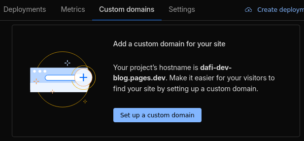

Input the domain you'd like to use and press "Continue".

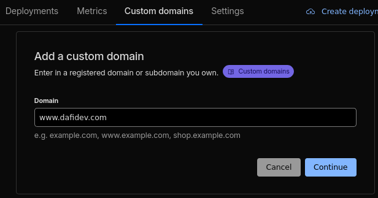

Under "My DNS provider" click on "Begin CNAME setup". You then need to follow instructions to add the new CNAME record, and click on "Check DNS records". It may take some time for the new DNS record to propagate.

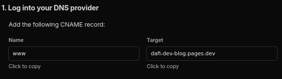

Here is how I had to configure it on my DNS provider (my DNS provider is [Njalla](https://njal.la), I choose this one because it's privacy friendly and very simple-to-use)

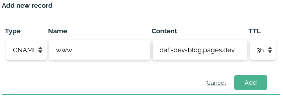

And here is how I set up the redirection from APEX to `www` subdomain (luckily Njalla supports redirections): I added a 301 redirect rule named `@` to the URL`https://www.dafidev.com{path}`. 301 means the redirect is permanent, this matters so that search engines index the correct URL.

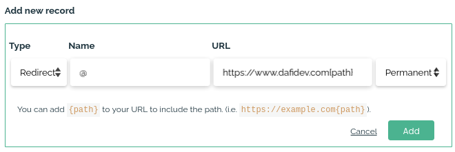

Your website is now accessible from your custom domain! Good news: Cloudflare automatically handles TLS

#### Prevent access to the .pages.dev production URL

Now that the custom domain is up and running, the .pages.dev URL should not be the main one anymore : it should redirect to your custom domain.

It's not possible to configure this kind of redirection with the `_redirects` file, instead we have to rely on the Bulk Redirects feature. I'll explain only my setup, please check the [official Bulk Redirects documentation](https://developers.cloudflare.com/rules/url-forwarding/bulk-redirects/) if needed.

To get to the Bulk Redirect configuration, on the Cloudflare dashboard, navigate to "Project & connect" > "Delivery & Performance" > "Bulk redirect" in the left sidebar

Start by clicking on "+ Create Bulk Redirect List"


Click on "Manually add URL redirects" and configure the bulk redirect list to redirect from {project name}.pages.dev to the custom domain you configured. Should be a 301 redirect too. Edit parameters to check "preserve query string", "subpath matching", and "preserve path suffix".

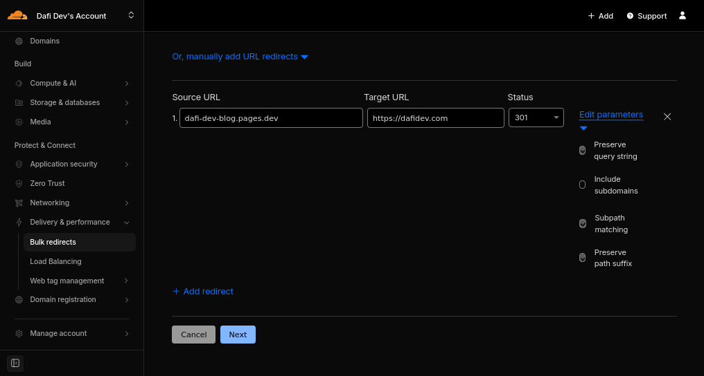

The newly created redirect list now needs to be activated thanks to a redirect rule. Go back to the Bulk Redirects dashboard and click on "+ Create Bulk Redirect Rule"

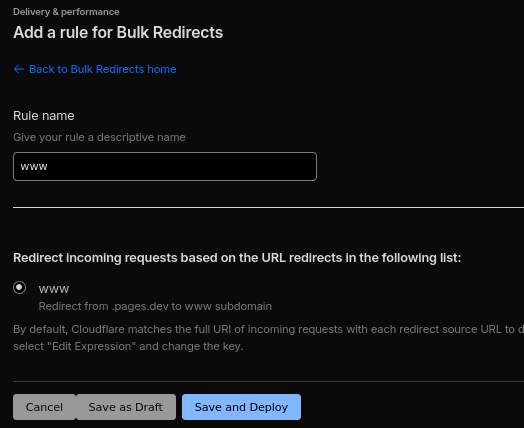

Click on "Save and Deploy"

You should now see this screen to confirm the redirect if activated: 

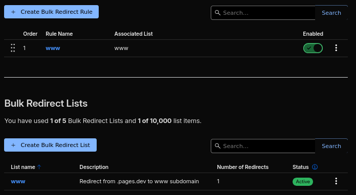

### Restrict access to preview deployments

Preview deployment are meant for you to preview versions of your your website on other branches than the main one (if any). They should not be visible by the public.

In order to restrict access, you can go to the settings of your project in Cloudflare dashboard, and in "Access Policy" section, click enable:

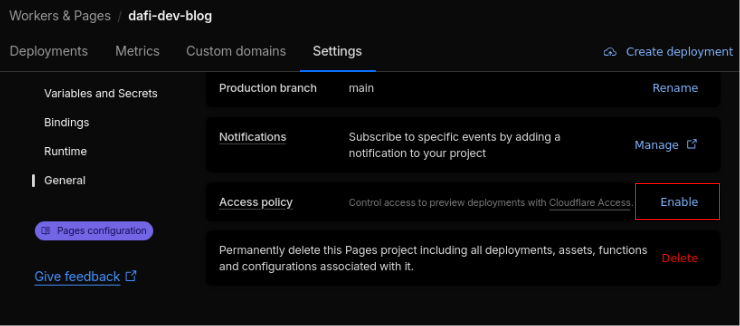

This feature relies on Cloudflare Access, restricting access to preview deployment is free, but it requires a valid credit card linked to your account

## Next steps

- Add analytics to get insights on the performance of your website

## Resources

- [Cloudflare pages documentation](https://developers.cloudflare.com/pages/)
- [GitHub Actions documentation](https://docs.github.com/en/actions)